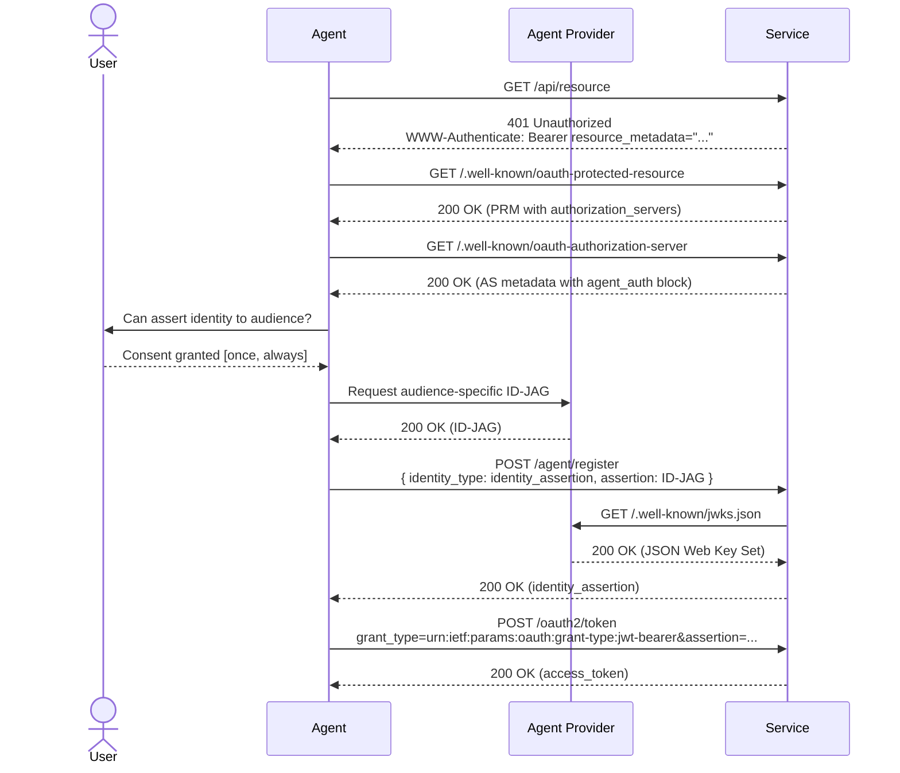

# Agent Auth Provider Guide

Agents are hitting walls trying to use APIs and SDKs that have been built to keep robots out for years. Requiring the end-user to sign up via the web, create an API key, and pass that to the agent is an unnecessary break in flow for everyone involved.

This protocol suggests an agent discovery layer on top of [Identity Assertion JWT Authorization Grants (ID-JAGs)](https://datatracker.ietf.org/doc/html/draft-ietf-oauth-identity-assertion-authz-grant) to enable trusted agent providers (you!) to authenticate with resource servers on behalf of users by asserting their identities.

Signing ID-JAGs makes your surface the identity broker for every service a user's agent touches — you keep the consent prompt, the revocation UX, and the delegation audit trail inside your product instead of leaking them to wherever the user would otherwise paste an API key.

## Identity Assertion Sequence



## Minimum Agent Provider Implementation

1. Enable agents to exchange their sessions for ID-JAG tokens upon user consent
2. Host discovery documents (JWKS, CIMD) that enable downstream services to validate and verify the ID-JAGs
3. Direct agents to introspect the `agent_auth` block of the consuming service's `.well-known/oauth-authorization-server`

### Discovering Agent Auth

Agents will discover the agent registration pathway through multiple channels, including service documentation, SDKs, and self-documenting APIs. The primary entry-point is an agent auth enrichment layer on the consuming service's OAuth Authorization Server metadata, surfaced via the [RFC 9728 (OAuth 2.0 Protected Resource Metadata)](https://datatracker.ietf.org/doc/html/rfc9728) handshake. Services can also publish an `auth.md` document that includes at least a breadcrumb to the protected resource document.

Discovery is two-hop:

1. **Protected Resource Metadata (PRM)** at `.well-known/oauth-protected-resource` (per RFC 9728) — the resource server advertises its authorization servers. On any 401, the resource server includes a `WWW-Authenticate: Bearer resource_metadata="..."` header pointing here:

   ```json
   {
     "resource": "https://api.service.com/",
     "resource_name": "Service",
     "resource_logo_uri": "https://service.com/logo.png",
     "authorization_servers": ["https://auth.service.com/"],
     "scopes_supported": ["api.read", "api.write"],
     "bearer_methods_supported": ["header"]
   }
   ```

2. **Authorization Server metadata** at `<authorization_servers[0]>/.well-known/oauth-authorization-server` — this is where the `agent_auth` block lives. The agent reads `authorization_servers[0]` from the PRM and fetches:

   ```json
   {
     "resource": "https://api.service.com/",
     "authorization_servers": ["https://auth.service.com/"],
     "scopes_supported": ["api.read", "api.write"],
     "bearer_methods_supported": ["header"],

     "issuer": "https://auth.service.com",
     "token_endpoint": "https://auth.service.com/oauth2/token",
     "revocation_endpoint": "https://auth.service.com/oauth2/revoke",
     "grant_types_supported": ["urn:ietf:params:oauth:grant-type:jwt-bearer"],

     "agent_auth": {
       "skill": "https://service.com/auth.md",
       "registration_endpoint": "https://auth.service.com/agent/register",
       "claim_endpoint": "https://auth.service.com/agent/register/claim",
       "events_endpoint": "https://auth.service.com/agent/event/notify",
       "identity_types_supported": ["anonymous", "identity_assertion"],
       "identity_assertion": {
         "assertion_types_supported": [
           "urn:ietf:params:oauth:token-type:id-jag",
           "verified_email"
         ]
       },
       "events_supported": [
         "https://schemas.workos.com/events/agent/identity/assertion/revoked"
       ]
     }
   }
   ```

   The top-level `token_endpoint`, `revocation_endpoint`, and `grant_types_supported` are standard [RFC 8414](https://datatracker.ietf.org/doc/html/rfc8414) / [RFC 7009](https://datatracker.ietf.org/doc/html/rfc7009) / [RFC 7523](https://datatracker.ietf.org/doc/html/rfc7523) fields. The `agent_auth` block carries the profile-specific bootstrap, claim, and SET-receive endpoints.

### Minting the Identity Assertion

```json
{
  "typ": "oauth-id-jag+jwt",
  "alg": "ES256", // or RS256, etc.
  "kid": "<provider key id>"
}
.
{
  // required
  "iss": "https://api.agent-provider.com",
  "sub": "<opaque user identifier>",
  "aud": "https://auth.service.com",
  "client_id": "<iss or CIMD URL>",
  "jti": "<unique identifier for the token to prevent replay>",
  "iat": <issuance epoch seconds>,
  "exp": <iat + 5m>,
  "email": "user@example.com",
  "email_verified": true,

  // optional
  "amr": ["mfa"],
  "auth_time": <original auth epoch seconds>,
  "name": "Jane Smith",
	"phone_number": "+15553805188",
	"phone_number_verified": false,
	"resource": "https://api.service.com",

  // optional agent metadata
  "agent_platform": "<your-agent-surface>",
  "agent_context_id": "<chat-id>"
}
```

### Hosted Discovery Documents

In order for consuming services to verify the ID-JAG tokens, agent providers must publish a document specifying their [JSON Web Key Sets (JWKS)](https://datatracker.ietf.org/doc/html/rfc7517), usually at `.well-known/jwks.json`.

**Optional: Client ID Metadata Document (CIMD).** Agent providers can also host an [OAuth Client ID Metadata Document](https://datatracker.ietf.org/doc/draft-ietf-oauth-client-id-metadata-document/) and use the URI as the `client_id` value in the ID-JAG. This decouples your provider identity from your signing keys — you can rotate JWKS without churning every consumer's trust list — and makes it convenient for trusted agent registries to list providers. Adopt this if you expect signing-key rotation or registry listing to matter; skip it for v0.1 and your `client_id` can be your issuer URL. The CIMD document might look something like:

```json
{
  "client_id": "https://api.agent-provider.com/agent-auth.json",
  "client_name": "Agent Provider",
  "logo_uri": "https://agent-provider.com/logo.png",
  "client_uri": "https://agent-provider.com",
  "tos_uri": "https://agent-provider.com/tos",
  "policy_uri": "https://agent-provider.com/privacy",
  "token_endpoint_auth_method": "private_key_jwt",
  "jwks_uri": "https://agent-provider.com/.well-known/jwks.json",
  "scope": "openid email profile"
}
```

### Acquiring Credentials

Once the ID-JAG is minted, the agent exchanges it for service credentials in two steps. The first hop registers the identity with the service; the second hop is a standard [RFC 7523](https://datatracker.ietf.org/doc/html/rfc7523) JWT-bearer token exchange.

**Step 1 — register the identity.** Submit the provider ID-JAG to the service's `registration_endpoint`:

```json
POST /agent/register HTTP/1.1
Host: auth.service.com
Content-Type: application/json

Payload:
{
  "identity_type": "identity_assertion",
  "assertion_type": "urn:ietf:params:oauth:token-type:id-jag",
  "assertion": "eyJhbGc..."
}

200 Response:
{
  "registration": {
    "id": "reg_...",
    "type": "agent-provider"
  },
  "identity_assertion": "<service-signed ID-JAG>",
  "expires": "2026-05-04T13:00:00.000Z"
}
```

The service verifies the provider ID-JAG, mints a service-signed identity assertion bound to the registration, and returns it. If the identity can't be settled immediately (e.g., the provider asserts an email that matches an existing account that has never been linked to this provider), the response carries a `claim` object instead and the agent walks the user through claim completion before continuing.

**Step 2 — exchange the assertion for a credential.** POST the service-signed assertion to the standard `token_endpoint`:

```
POST /oauth2/token HTTP/1.1
Host: auth.service.com
Content-Type: application/x-www-form-urlencoded

grant_type=urn:ietf:params:oauth:grant-type:jwt-bearer
&assertion=<service-signed ID-JAG>
&resource=https://api.service.com/
```

```json
200 Response:
{
  "access_token": "<token>",
  "token_type": "Bearer",
  "expires_in": 3600,
  "scope": "api.read api.write"
}
```

If the access_token expires, the agent re-calls `/oauth2/token` with the same identity assertion. If the assertion itself is expired or revoked, `/oauth2/token` returns `invalid_grant` and the agent re-calls `/agent/register` to mint a fresh one.

The ID-JAG spec specifies that access tokens returned from ID-JAG verification should not include a refresh token. The two-step refresh pattern above replaces it.

#### Errors

Errors at `/agent/register` describe profile-specific states; errors at `/oauth2/token` follow OAuth-standard vocabulary.

| Endpoint          | Error code                         | Meaning                                                                                                                                                 |
| ----------------- | ---------------------------------- | ------------------------------------------------------------------------------------------------------------------------------------------------------- |
| `/agent/register` | `issuer_not_enabled`               | Token `iss` isn't in the service's trusted providers list.                                                                                              |
| `/agent/register` | `invalid_request`                  | Body shape, missing claims, or unverified identity (neither `email_verified` nor `phone_number_verified` is `true`).                                    |
| `/oauth2/token`   | `invalid_grant`                    | Assertion failed verification, expired, replayed, audience-mismatched, or has been revoked.                                                             |
| `/oauth2/token`   | `invalid_client`                   | `client_id` doesn't resolve to a known provider identity.                                                                                               |
| `/oauth2/token`   | `unsupported_grant_type`           | `grant_type` is not `urn:ietf:params:oauth:grant-type:jwt-bearer`.                                                                                      |
| `/oauth2/token`   | `insufficient_user_authentication` | Auth context didn't meet policy ([RFC 9470](https://datatracker.ietf.org/doc/html/rfc9470)). Agent re-calls `/agent/register` and walks the claim flow. |

## Downstream Verification

Services will maintain a list of trusted agent providers. The service will attempt to match to an existing customer, looking for matches on `(iss, sub)` and then email/phone for JIT provisioning, and will determine whether to create a new account or permit using the identity assertion to return credentials for an existing account.

Services will reject ID-JAGs with neither a verified email nor a verified phone number. If the service is satisfied by the validity of the identity assertion, it will return a service-signed identity assertion the agent can then exchange at `/oauth2/token` for an access_token.

## Tracking and Revocation

In a robust implementation, agent providers will want to track the services to which identity assertions have been delegated so that the user can revoke the delegation if needed from a control plane. The discovery document's `agent_auth.events_endpoint` is where the provider transmits identity-event SETs to the service. Transmission is the canonical [RFC 8935](https://datatracker.ietf.org/doc/html/rfc8935) push-based delivery of a [Security Event Token (RFC 8417)](https://datatracker.ietf.org/doc/html/rfc8417):

```json
POST /agent/event/notify HTTP/1.1
Host: auth.service.com
Content-Type: application/secevent+jwt

// header
{
  "typ": "secevent+jwt",
  "alg": "ES256", // or RS256, etc.
  "kid": "<provider key id>"
}
.
// payload
{
  "iss": "https://api.agent-provider.com",
  "sub": "<opaque user identifier>",
  "aud": "https://auth.service.com",
  "jti": "<unique identifier to prevent replay>",
  "iat": <epoch seconds>,
  "events": {
    "https://schemas.workos.com/events/agent/identity/assertion/revoked": {}
  }
}
```

The receiving service validates the SET against the provider's JWKS, dispatches on the `events` claim, and invalidates the identity assertion (and the credentials derived from it). Per RFC 8935 §2.4, a successful receive returns 202 Accepted; failures return 400 with `{ "err": "<code>", "description": "..." }`.

Note that this `events_endpoint` is distinct from the top-level `revocation_endpoint`. The `revocation_endpoint` ([RFC 7009](https://datatracker.ietf.org/doc/html/rfc7009)) is for the agent or admin to kill a single bearer credential by value. The `events_endpoint` is for the provider to notify the service of an upstream identity event — a broader signal that invalidates the registration itself.

In a future state, we expect richer [SET](https://datatracker.ietf.org/doc/html/rfc8417) / [CAEP](https://openid.net/specs/openid-caep-1_0-final.html) / RISC event communication between agent providers and consuming services, layered on this same push-based SET delivery channel.
