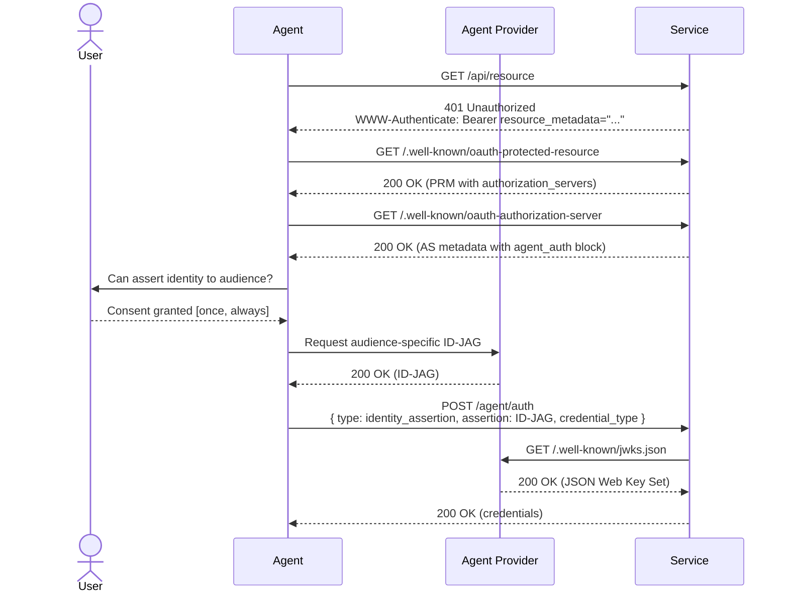

# Agent Auth Provider Guide

Agents are hitting walls trying to use APIs and SDKs that have been built to keep robots out for years. Requiring the end-user to sign up via the web, create an API key, and pass that to the agent is an unnecessary break in flow for everyone involved.

This protocol suggests an agent discovery layer on top of [Identity Assertion JWT Authorization Grants (ID-JAGs)](https://datatracker.ietf.org/doc/html/draft-ietf-oauth-identity-assertion-authz-grant) to enable trusted agent providers (you!) to authenticate with resource servers on behalf of users by asserting their identities.

Signing ID-JAGs makes your surface the identity broker for every service a user's agent touches — you keep the consent prompt, the revocation UX, and the delegation audit trail inside your product instead of leaking them to wherever the user would otherwise paste an API key.

## Identity Assertion Sequence



## Minimum Agent Provider Implementation

1. Enable agents to exchange their sessions for ID-JAG tokens upon user consent
2. Host discovery documents (JWKS, CIMD) that enable downstream services to validate and verify the ID-JAGs
3. Direct agents to introspect the `agent_auth` block of the consuming service's `.well-known/oauth-authorization-server`

### Discovering Agent Auth

Agents will discover the agent registration pathway through multiple channels, including service documentation, SDKs, and self-documenting APIs. The primary entry-point is an agent auth enrichment layer on the consuming service's OAuth Authorization Server metadata, surfaced via the [RFC 9728 (OAuth 2.0 Protected Resource Metadata)](https://datatracker.ietf.org/doc/html/rfc9728) handshake. Services can also publish an `auth.md` document that includes at least a breadcrumb to the protected resource document.

Discovery is two-hop:

1. **Protected Resource Metadata (PRM)** at `.well-known/oauth-protected-resource` (per RFC 9728) — the resource server advertises its authorization servers. On any 401, the resource server includes a `WWW-Authenticate: Bearer resource_metadata="..."` header pointing here:

   ```json
   {
     "resource": "https://api.service.example.com/",
     "resource_name": "Service",
     "resource_logo_uri": "https://service.example.com/logo.png",
     "authorization_servers": ["https://auth.service.example.com/"],
     "scopes_supported": ["api.read", "api.write"],
     "bearer_methods_supported": ["header"]
   }
   ```

2. **Authorization Server metadata** at `<authorization_servers[0]>/.well-known/oauth-authorization-server` — this is where the `agent_auth` block lives. The agent reads `authorization_servers[0]` from the PRM and fetches:

   ```json
   {
     "resource": "https://api.service.example.com/",
     "authorization_servers": ["https://auth.service.example.com/"],
     "scopes_supported": ["api.read", "api.write"],
     "bearer_methods_supported": ["header"],
     "agent_auth": {
       "skill": "https://service.example.com/auth.md",
       "register_uri": "https://auth.service.example.com/agent/auth",
       "claim_uri": "https://auth.service.example.com/agent/auth/claim",
       "revocation_uri": "https://auth.service.example.com/agent/auth/revoke",
       "identity_types_supported": ["anonymous", "identity_assertion"],
       "anonymous": {
         "credential_types_supported": ["api_key"]
       },
       "identity_assertion": {
         "assertion_types_supported": [
           "urn:ietf:params:oauth:token-type:id-jag",
           "verified_email"
         ],
         "credential_types_supported": ["access_token", "api_key"]
       },
       "events_supported": [
         "https://schemas.workos.com/events/agent/auth/identity/assertion/revoked"
       ]
     }
   }
   ```

### Minting the Identity Assertion

```json
{
  "typ": "oauth-id-jag+jwt",
  "alg": "ES256", // or RS256, etc.
  "kid": "<provider key id>"
}
.
{
  // required
  "iss": "https://api.agent-provider.example.com",
  "sub": "<opaque user identifier>",
  "aud": "https://auth.service.example.com",
  "client_id": "<iss or CIMD URL>",
  "jti": "<unique identifier for the token to prevent replay>",
  "iat": <issuance epoch seconds>,
  "exp": <iat + 5m>,
  "email": "user@example.com",
  "email_verified": true,

  // optional
  "amr": ["mfa"],
  "auth_time": <original auth epoch seconds>,
  "name": "Jane Smith",
	"phone_number": "+15553805188",
	"phone_number_verified": false,
	"resource": "https://api.service.example.com",

  // optional agent metadata
  "agent_platform": "<your-agent-surface>",
  "agent_context_id": "<chat-id>"
}
```

### Hosted Discovery Documents

In order for consuming services to verify the ID-JAG tokens, agent providers must publish a document specifying their [JSON Web Key Sets (JWKS)](https://datatracker.ietf.org/doc/html/rfc7517), usually at `.well-known/jwks.json`.

**Optional: Client ID Metadata Document (CIMD).** Agent providers can also host an [OAuth Client ID Metadata Document](https://datatracker.ietf.org/doc/draft-ietf-oauth-client-id-metadata-document/) and use the URI as the `client_id` value in the ID-JAG. This decouples your provider identity from your signing keys — you can rotate JWKS without churning every consumer's trust list — and makes it convenient for trusted agent registries to list providers. Adopt this if you expect signing-key rotation or registry listing to matter; skip it for v0.1 and your `client_id` can be your issuer URL. The CIMD document might look something like:

```json
{
  "client_id": "https://api.agent-provider.example.com/agent-auth.json",
  "client_name": "Agent Provider",
  "logo_uri": "https://agent-provider.example.com/logo.png",
  "client_uri": "https://agent-provider.example.com",
  "tos_uri": "https://agent-provider.example.com/tos",
  "policy_uri": "https://agent-provider.example.com/privacy",
  "token_endpoint_auth_method": "private_key_jwt",
  "jwks_uri": "https://agent-provider.example.com/.well-known/jwks.json",
  "scope": "openid email profile"
}
```

### Acquiring Credentials

Once the ID-JAG is minted, the agent can exchange it for service credentials:

```json
POST /agent/auth HTTP/1.1
Host: auth.service.example.com
Content-Type: application/json

Payload:
{
  "type": "identity_assertion",
  "assertion_type": "urn:ietf:params:oauth:token-type:id-jag",
  "assertion": "eyJhbGc...",
  "requested_credential_type": "<access_token | api_key>"
}

200 Response (access_token):
{
  "registration_id": "reg_...",
  "registration_type": "agent-provider",
  "credential_type": "access_token",
  "credential": "<token>",
  "credential_expires": "2026-05-04T13:00:00.000Z",
  "scopes": ["api.read", "api.write"]
}

200 Response (api_key):
{
  "registration_id": "reg_...",
  "registration_type": "agent-provider",
  "credential_type": "api_key",
  "credential": "sk_live_...",
  "credential_expires": null,
  "scopes": ["api.read", "api.write"]
}

400 Response:
{ "error": "invalid_audience", "message": "..." }
```

The spec supports both `access_token` and `api_key` credentials, with implementation up to the service.

The ID-JAG spec specifies that access tokens returned from ID-JAG verification should not include a refresh token. If the agent wants to extend the life of its access token for a specific audience, it should follow the same flow to get a new credential.

#### Errors

| Error code                         | Meaning                                                                                              |
| ---------------------------------- | ---------------------------------------------------------------------------------------------------- |
| `invalid_issuer`                   | Token `iss` isn't in the service's trusted providers list.                                           |
| `invalid_signature`                | JWKS lookup failed or the signature didn't verify against any known key.                             |
| `expired`                          | `exp` is in the past.                                                                                |
| `replay_detected`                  | `jti` has already been seen within the replay window.                                                |
| `invalid_audience`                 | `aud` doesn't match the service's auth server.                                                       |
| `invalid_client_id`                | `client_id` doesn't resolve to a known provider identity.                                            |
| `missing_verified_email`           | Neither `email_verified` nor `phone_number_verified` is `true`.                                      |
| `unsupported_credential_type`      | Requested credential type isn't offered by the service.                                              |
| `insufficient_user_authentication` | Auth context didn't meet policy ([RFC 9470](https://datatracker.ietf.org/doc/html/rfc9470) pattern). |

## Downstream Verification

Services will maintain a list of trusted agent providers. The service will attempt to match to an existing customer, looking for matches on `(iss, sub)` and then email/phone for JIT provisioning, and will determine whether to create a new account or permit using the identity assertion to return credentials for an existing account.

Services will reject ID-JAGs with neither a verified email nor a verified phone number. If the service is satisfied by the validity of the identity assertion, it will return credentials of the requested type.

## Tracking and Revocation

In a robust implementation, agent providers will want to track the services to which identity assertions have been delegated so that the user can revoke the credentials if needed from a control plane. The discovery document and the API response both contain the endpoint for revoking the assertion. The mechanism is a [logout token](https://openid.net/specs/openid-connect-backchannel-1_0.html):

```json
POST /agent/auth/revoke HTTP/1.1
Host: auth.service.example.com
Content-Type: application/logout+jwt

// header
{
  "typ": "logout+jwt",
  "alg": "ES256", // or RS256, etc.
  "kid": "<provider key id>"
}
.
// payload
{
  "iss": "https://api.agent-provider.example.com",
  "sub": "<opaque user identifier>",
  "aud": "https://auth.service.example.com",
  "jti": "<unique identifier to prevent replay>",
  "iat": <epoch seconds>,
  "events": {
    "https://schemas.workos.com/events/agent/auth/identity/assertion/revoked": {}
  }
}
```

Receiving services invalidate credentials associated with the ID-JAG.

In a future state, we expect the need for [SET](https://datatracker.ietf.org/doc/html/rfc8417) / [CAEP](https://openid.net/specs/openid-caep-1_0-final.html) / RISC event communication between the agent providers and the consuming services, via webhook or SSE.
