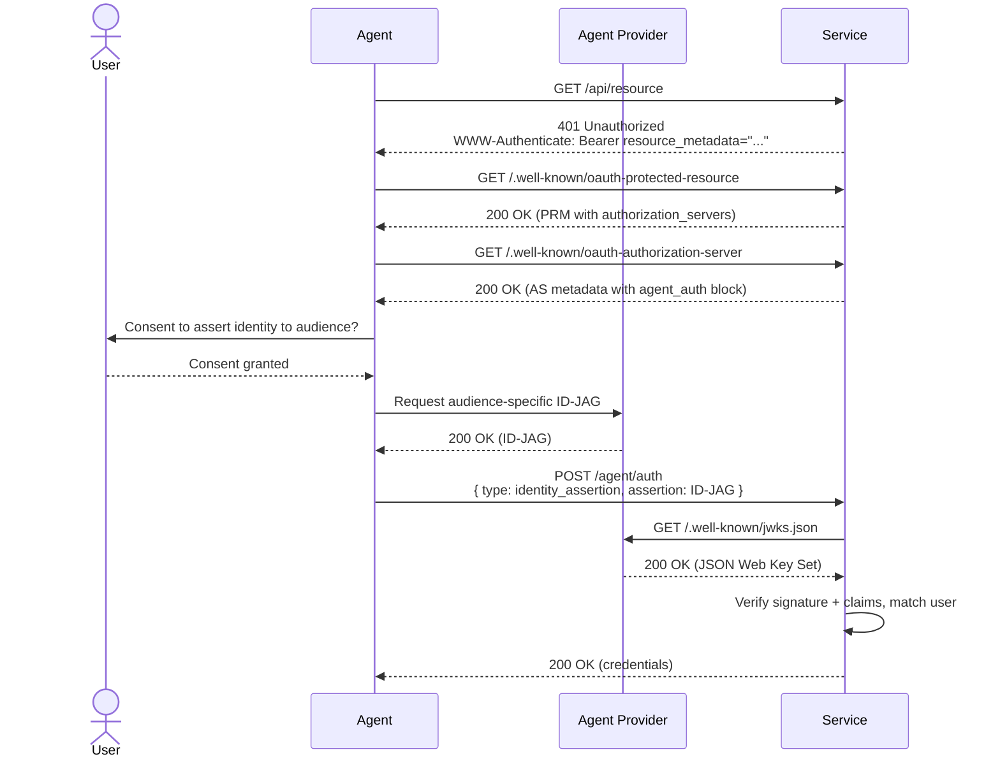
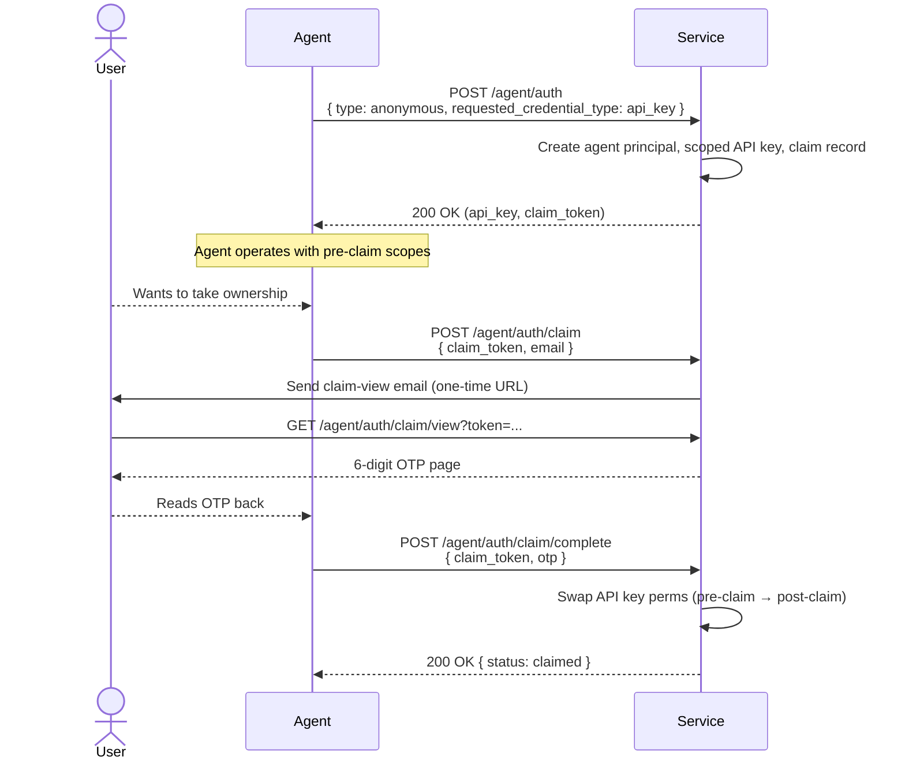
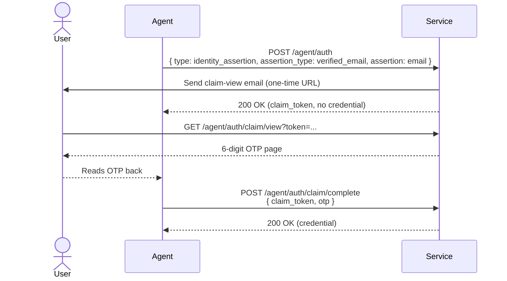

# Agent Auth Consumer Guide

Services that want agents to authenticate on behalf of users — via Identity Assertion JWT Authorization Grants ([ID-JAGs](https://datatracker.ietf.org/doc/html/draft-ietf-oauth-identity-assertion-authz-grant)) from trusted providers, via a verified-email OTP ceremony, or via anonymous self-registration when no user identity is available — need to publish discovery metadata and implement the `/agent/auth` endpoints described here.

This guide covers three flows:

1. **ID-JAG identity assertion** — trusted agent providers (OpenAI, Anthropic, Cursor, etc.) assert a user's identity with an ID-JAG. The service verifies the assertion and returns credentials for the matched user synchronously.
2. **Verified-email identity assertion** — the agent gives us a user email; the service emails the user a one-time code, the user reads the code to the agent, the agent completes the claim and receives a credential.
3. **Anonymous registration** — an agent with no user identity self-registers for scoped credentials and optionally invites a human to take ownership later via the same OTP ceremony.

All three flows share the same `/agent/auth` registration endpoint. Verified-email and anonymous flows additionally use `/agent/auth/claim` and `/agent/auth/claim/complete` to drive the OTP exchange.

**Why adopt this.** ID-JAG is a near-drop-in if your service already JIT-provisions users via OIDC or SAML — it's standard JWT verification against a provider JWKS plus a delegation record per `(iss, sub, aud)`, with no user-model changes. The OTP flows are a real extension (a pre-claim principal state, a claim state machine, a scope-set swap) but they unlock MCP-server agents that start with no user identity — a use case nothing else handles cleanly. All three flows give users a real revoke surface for agent delegations, instead of copy-pasted API keys the service has no visibility into.

## Sequence Diagrams

### Identity Assertion



### Anonymous Registration + OTP Claim



### Verified-Email Identity Assertion



## Minimum Consumer Implementation

To participate as a consumer service, you should:

1. Publish `.well-known/oauth-protected-resource` (resource + `authorization_servers`) and `.well-known/oauth-authorization-server` (carries the `agent_auth` block)
2. Return `WWW-Authenticate: Bearer resource_metadata="..."` on 401 responses
3. Host a `/agent/auth` endpoint that dispatches on `type`
4. Maintain a trust list of agent providers (for `identity_assertion`)
5. Verify ID-JAG signatures against the provider's JWKS and enforce claim checks
6. Issue credentials of the configured type (`access_token` or `api_key`)
7. Accept revocation logout tokens at the advertised `revocation_uri`
8. Record audit events for every state change in the flow

### Publishing the Discovery Documents

Discovery is split in two:

1. The Protected Resource Metadata at `/.well-known/oauth-protected-resource` (per [RFC 9728](https://datatracker.ietf.org/doc/html/rfc9728)) advertises the resource and points at the Authorization Server.
2. The Authorization Server metadata at `/.well-known/oauth-authorization-server` carries the `agent_auth` block describing supported flows.

PRM:

```json
{
  "resource": "https://api.service.example.com/",
  "resource_name": "Service",
  "resource_logo_uri": "https://service.example.com/logo.png",
  "authorization_servers": ["https://auth.service.example.com/"],
  "scopes_supported": ["api.read", "api.write"],
  "bearer_methods_supported": ["header"]
}
```

AS metadata:

```json
{
  "resource": "https://api.service.example.com/",
  "authorization_servers": ["https://auth.service.example.com/"],
  "scopes_supported": ["api.read", "api.write"],
  "bearer_methods_supported": ["header"],
  "agent_auth": {
    "skill": "https://service.example.com/auth.md",
    "register_uri": "https://auth.service.example.com/agent/auth",
    "claim_uri": "https://auth.service.example.com/agent/auth/claim",
    "revocation_uri": "https://auth.service.example.com/agent/auth/revoke",
    "identity_types_supported": ["anonymous", "identity_assertion"],
    "anonymous": {
      "credential_types_supported": ["api_key"]
    },
    "identity_assertion": {
      "assertion_types_supported": [
        "urn:ietf:params:oauth:token-type:id-jag",
        "verified_email"
      ],
      "credential_types_supported": ["access_token", "api_key"]
    },
    "events_supported": [
      "https://schemas.workos.com/events/agent/auth/identity/assertion/revoked"
    ]
  }
}
```

Advertise the identity types and assertion types your service accepts. Anonymous is the simplest if you only support self-registration; ID-JAG is for trusted-provider integrations; the verified email assertion type is for agents that have a user email but no provider-signed assertion.

On any 401 from your API, include the discovery hint:

```
HTTP/1.1 401 Unauthorized
WWW-Authenticate: Bearer resource_metadata="https://api.service.example.com/.well-known/oauth-protected-resource"
```

Consider also publishing an `auth.md` at your root — a short, LLM-readable summary of your agent auth posture that points back at the PRM, for agents that discover via documentation rather than 401 probing.

### Hosting the /agent/auth Endpoint

The endpoint dispatches on the `type` field. All requests scope to a single tenant / environment; how the service resolves that scope (hostname, bearer token, path prefix) is up to the implementation.

```http
POST /agent/auth HTTP/1.1
Host: auth.service.example.com
Content-Type: application/json
```

#### type: identity_assertion

Request:

```json
{
  "type": "identity_assertion",
  "assertion_type": "urn:ietf:params:oauth:token-type:id-jag",
  "assertion": "eyJhbGc...",
  "requested_credential_type": "access_token"
}
```

Implementation steps:

1. **Decode the ID-JAG header** to obtain `kid` and `alg`.
2. **Look up the issuer (`iss`)** in your trusted providers list. Reject if unknown.
3. **Fetch JWKS** from the provider (see [Verifying ID-JAGs](#verifying-id-jags) for caching).
4. **Verify the signature** using the key matching `kid`.
5. **Validate claims:** `aud` matches your auth server; `exp` is future; `iat` is not unreasonably future; `jti` has not been seen recently; `client_id` resolves to a known provider identity; at least one of `email_verified` or `phone_number_verified` is `true`.
6. **Match or provision the user** (see [User Matching and JIT Provisioning](#user-matching-and-jit-provisioning)).
7. **Issue credentials** of the requested type.

Successful response (`access_token`):

```json
{
  "registration_id": "reg_...",
  "registration_type": "agent-provider",
  "credential_type": "access_token",
  "credential": "<token>",
  "credential_expires": "2026-05-04T13:00:00.000Z",
  "scopes": ["api.read", "api.write"]
}
```

Successful response (`api_key`):

```json
{
  "registration_id": "reg_...",
  "registration_type": "agent-provider",
  "credential_type": "api_key",
  "credential": "sk_live_...",
  "credential_expires": null,
  "scopes": ["api.read", "api.write"]
}
```

Access tokens issued from ID-JAG verification must not include a refresh token — the spec requires the agent to present a fresh ID-JAG to extend access.

Error response (400):

```json
{ "error": "invalid_audience", "message": "..." }
```

Supported error codes: `invalid_issuer`, `invalid_signature`, `expired`, `replay_detected`, `invalid_audience`, `invalid_client_id`, `missing_verified_email`, `unsupported_credential_type`, `insufficient_user_authentication` (RFC 9470 — auth context didn't meet policy).

#### type: anonymous

Request:

```json
{ "type": "anonymous", "requested_credential_type": "api_key" }
```

Implementation steps:

1. Apply rate limits (see [Rate Limiting](#rate-limiting)).
2. Create the principal that will own the credentials. The shape is up to the service — it might be a user, workspace, account, tenant, or organization. Flag it as agent-created so downstream events and UI can distinguish it.
3. Issue an API key scoped to your configured pre-claim (untrusted) permissions.
4. Generate a claim token (prefixed, high-entropy — e.g., `clm_` + 25 chars base62). Store only its SHA-256 hash. Return the plaintext exactly once.
5. Schedule an expiration job at the registration's TTL to revoke the API key and mark the claim expired.

Successful response:

```json
{
  "registration_id": "reg_01ABC123DEF456GHI789JKL0MN",
  "registration_type": "anonymous",
  "credential_type": "api_key",
  "credential": "sk_test_abcdefghijklmnop123456789",
  "credential_expires": null,
  "scopes": ["api.read"],
  "claim_url": "/agent/auth/claim",
  "claim_token": "clm_abc123def456ghi789jkl012mno",
  "claim_token_expires": "2026-04-22T12:34:56.789Z",
  "post_claim_scopes": ["api.read", "api.write"]
}
```

See [OTP Claim Flow](#otp-claim-flow) for `/agent/auth/claim` and `/agent/auth/claim/complete`.

#### type: identity_assertion (verified email)

Request:

```json
{
  "type": "identity_assertion",
  "assertion_type": "verified_email",
  "assertion": "user@example.com",
  "requested_credential_type": "api_key"
}
```

Implementation steps:

1. Create a registration row marked as `email-verification` and persist the asserted email and requested credential type.
2. Generate a `claim_token` (returned to the agent) and a `claim_attempt_token` (delivered in the email link). Store SHA-256 hashes of both.
3. Email the user a link to a server-rendered claim page. The page POSTs to [`/agent/auth/claim/attempt/challenge`](#post-agentauthclaimattemptchallenge--mint-the-otp-for-the-claim-page) to mint the OTP, which the user reads back to the agent.
4. Return the claim handles — but **no credential**. Credentials are issued on `/agent/auth/claim/complete` once the OTP is verified.

Successful response:

```json
{
  "registration_id": "reg_01ABC...",
  "registration_type": "email-verification",
  "claim_url": "/agent/auth/claim",
  "claim_token": "clm_abc123...",
  "claim_token_expires": "2026-04-22T12:34:56.789Z",
  "post_claim_scopes": ["api.read", "api.write"]
}
```

### Verifying ID-JAGs

A compliant ID-JAG header is `{ "typ": "oauth-id-jag+jwt", "alg", "kid" }`. The body includes `iss`, `sub`, `aud`, `client_id`, `jti`, `iat`, `exp`, and identity claims like `email` / `email_verified`. See the provider guide for the full shape.

**Trust list.** Maintain a registry of providers whose assertions you accept. A minimum entry is an issuer URL; richer entries pin a JWKS URI, a CIMD URL, or an attestation policy (e.g. "requires `mfa` in `amr`"). Treat this list as security-critical configuration — compromising a trusted provider means compromising every delegation routed through them.

**JWKS fetching.** Fetch `{iss}/.well-known/jwks.json` on first use and cache per the response's `Cache-Control`, with a sane floor (e.g., 10 minutes) and ceiling (e.g., 24 hours). On `kid` cache miss, refetch once before rejecting — this handles provider key rotation gracefully.

**CIMD resolution.** If `client_id` is a URL rather than an opaque identifier, fetch it as an [OAuth Client ID Metadata Document](https://datatracker.ietf.org/doc/draft-ietf-oauth-client-id-metadata-document/) and verify its `jwks_uri` matches the one you used to verify the signature. This decouples the provider's identity from their signing keys so rotation doesn't churn your trust list.

**Replay protection.** Keep a cache of seen `jti` values with a TTL of at least `exp - iat` plus clock skew (a 5-minute assertion + 1 minute of skew → 6 minutes of cache). Redis, Memcached, or an indexed database table with a TTL column all work. Reject on collision with `replay_detected`.

**Clock skew.** Accept `iat` up to ~1–2 minutes in the future to accommodate drift between provider and consumer clocks.

### User Matching and JIT Provisioning

When an ID-JAG arrives, decide which of your users it represents. Recommended resolution order:

1. **Delegation record match.** If you've previously issued credentials for this `(iss, sub)`, route to the same user. This is the strongest identifier — it's what the provider considers stable.
2. **Verified email match.** If a user exists with the same verified email, link. Note this is _your_ verification; a provider asserting `email_verified: true` reflects their verification, which you may or may not accept as sufficient.
3. **Verified phone match.** Same pattern.
4. **No match → JIT.** Create a new user per your provisioning policy, or refuse with `missing_verified_email`-adjacent semantics if your product requires manual onboarding.

Reject ID-JAGs with neither a verified email nor a verified phone — there's no basis for matching and no channel for user-facing communications (revocation notices, claim emails, etc.).

### OTP Claim Flow

Both `anonymous` and `verified_email` flows funnel into the same OTP ceremony. The difference is _when_ the email is sent and _what_ `/complete` returns:

| Flow           | Email sent at                | `/complete` returns                                                       |
| -------------- | ---------------------------- | ------------------------------------------------------------------------- |
| Anonymous      | `/agent/auth/claim`          | `{ status: "claimed" }` only — existing API key's scopes upgrade in place |
| Verified-email | `/agent/auth` (registration) | `{ status: "claimed", credential, ... }` — fresh credential issued        |

#### POST /agent/auth/claim — Anonymous claim entry

Anonymous-only. Verified-email registrations skip this step — their email is sent at `/agent/auth` already.

Request:

```json
{
  "claim_token": "clm_abc123...",
  "email": "user@example.com"
}
```

Response (200):

```json
{
  "registration_id": "reg_01ABC...",
  "claim_attempt_id": "cla_01XYZ...",
  "status": "initiated",
  "expires_at": "2026-05-04T12:10:00.000Z"
}
```

`claim_attempt_id` identifies the current claim attempt. A new identifier is minted each time a fresh attempt is initiated at `/agent/auth/claim` — including retries with the same email after a prior attempt expired. `registration_id` stays stable for the lifetime of the registration.

Implementation notes:

- Hash the incoming `claim_token` and look up the registration. Reject if not found (`invalid_claim_token`), already claimed (`claimed_or_in_flight`), or expired (`claim_expired`).
- Mint a `claim_attempt_token`, store its SHA-256 hash, and email the user a link that includes the plaintext token.
- The link lands on a service-hosted page. The page POSTs the `claim_attempt_token` to [`/agent/auth/claim/attempt/challenge`](#post-agentauthclaimattemptchallenge--mint-the-otp-for-the-claim-page) to mint and display the OTP, which the user reads back to the agent.
- Communicate to the user that an agent is requesting ownership, and make it easy to reject if unrecognized.

#### POST /agent/auth/claim/attempt/challenge — Mint the OTP for the claim page

Called by the user's browser when it renders the claim page, **not by the agent**. The user lands on the service's claim page from the email link; the page POSTs the `claim_attempt_token` (from the URL) to this endpoint to mint a short-lived OTP and display it.

Gating OTP minting behind a POST keeps the email link safe to fetch — link-preview scanners and accidental refreshes don't burn codes. Production deployments should gate this endpoint with a HAK session (or equivalent user-binding signal) so only the legitimate user can trigger a mint.

Request:

```json
{ "claim_attempt_token": "cv_abc123..." }
```

Response (200):

```json
{
  "type": "otp",
  "challenge": "123456",
  "expires_at": "2026-05-04T12:10:00.000Z"
}
```

Errors:

| Status | Code               | Meaning                                      |
| ------ | ------------------ | -------------------------------------------- |
| 400    | `invalid_request`  | Malformed body.                              |
| 410    | `claim_superseded` | Token invalid or rotated by a newer attempt. |
| 409    | `claim_completed`  | Registration already claimed.                |
| 410    | `claim_expired`    | Claim window has closed.                     |

Calling this endpoint again on the same registration mints a fresh OTP and invalidates the prior one — so a page refresh rotates the code.

#### POST /agent/auth/claim/complete — Finish the ceremony

The agent collects the OTP from the user and finishes the claim:

```json
{ "claim_token": "clm_abc123...", "otp": "123456" }
```

Response (200) for anonymous:

```json
{ "registration_id": "reg_01ABC...", "status": "claimed" }
```

Response (200) for verified-email:

```json
{
  "registration_id": "reg_01ABC...",
  "status": "claimed",
  "credential_type": "access_token",
  "credential": "...",
  "credential_expires": "2026-05-04T13:00:00.000Z",
  "scopes": ["api.read", "api.write"]
}
```

Implementation notes:

- Hash both the `claim_token` and the OTP, compare to stored hashes. Reject with `otp_invalid` (401), `otp_expired` (410), `previously_claimed` (409), or `claim_expired` (410).
- For anonymous: link the existing credential to the matched/JIT'd user, replace its scope set with `post_claim_scopes`, and don't rotate the token. Agents keep the same key.
- For verified-email: issue a fresh credential of the type requested at registration (`access_token` or `api_key`).
- Emit `claim.confirmed` (see [Recommended Audit Events](#recommended-audit-events)).

**Why in-place permission swap on anonymous?** The agent doesn't need to handle a rotation flow or poll for a new key, there's no race window between claim confirmation and the agent discovering it needs to re-exchange, and it's consistent with how most permission systems (IAM, RBAC, database grants, GitHub PATs) operate. The trade-off is that any party who captured the key value pre-claim retains access post-claim with the new scopes. For higher-security tenants, offer a forced-rotation opt-in.

### Revocation

Accept logout tokens at the `revocation_uri` advertised in your discovery document. The provider signs a [logout token](https://openid.net/specs/openid-connect-backchannel-1_0.html) referencing the delegation to revoke:

```
POST /agent/auth/revoke HTTP/1.1
Host: auth.service.example.com
Content-Type: application/logout+jwt

{ "typ": "logout+jwt", "alg", "kid" }
.
{
  "iss": "https://api.agent-provider.example.com",
  "sub": "<opaque user identifier>",
  "aud": "https://auth.service.example.com",
  "jti": "<unique identifier>",
  "iat": <epoch seconds>,
  "events": {
    "https://schemas.workos.com/events/agent/auth/identity/assertion/revoked": {}
  }
}
```

On receipt:

1. Verify the logout token's signature against the issuer's JWKS (same trust path as ID-JAG verification).
2. Enforce `jti` uniqueness for replay protection.
3. Find all credentials issued for `(iss, sub, aud)` and invalidate them.
4. Return 200 on success, 400 on verification failure.

In a future state, expect to extend this surface with [SET](https://datatracker.ietf.org/doc/html/rfc8417) / [CAEP](https://openid.net/specs/openid-caep-1_0-final.html) / RISC event communication for session changes beyond revocation, delivered via webhook or SSE.

### Rate Limiting

The `/agent/auth` endpoint is unauthenticated for anonymous registration and accepts bearer ID-JAGs for identity assertion. Both paths benefit from two-tier rate limiting, checked in order:

1. **Per-IP limit** (checked first). Prevents a single source from consuming the tenant's budget. Sensible default: 5/hour for anonymous, 60/hour for identity_assertion.
2. **Per-tenant limit** (checked second). Global cap across IPs. Sensible default: 100/hour anonymous, 1000/hour identity_assertion.

Use a sliding-window counter backed by a shared store (Redis is common). Fail open on store errors to avoid blocking legitimate traffic. If no IP is available (e.g., stripped by a proxy), skip the per-IP check rather than rejecting.

### Recommended Audit Events

Record the following state transitions for observability and incident response. How they're exposed — audit log, webhook, SIEM stream, admin API — is an implementation choice; the set of events and the data they carry is the useful baseline.

| Event                  | When                                                    | Recommended fields                      |
| ---------------------- | ------------------------------------------------------- | --------------------------------------- |
| `registration.created` | Any successful `/agent/auth` POST                       | `registration_id`, `registration_type`  |
| `claim.requested`      | `/agent/auth/claim` called (or implicit on email-verif) | `registration_id`, `email`              |
| `otp.generated`        | OTP minted for the claim view                           | `registration_id`                       |
| `claim.confirmed`      | `/agent/auth/claim/complete` succeeds                   | `registration_id`, `claimed_by_user_id` |
| `registration.expired` | Unclaimed registration past its TTL                     | `registration_id`                       |
| `registration.revoked` | Logout token processed                                  | `registration_id`, `iss`, `sub`         |

For ID-JAG flows, include `iss`, `sub`, `agent_platform`, and `agent_context_id` so operators can correlate with provider-side logs.

Services that already expose resource events (for API keys, invitations, membership, or whatever principal the service creates) should consider tagging those events with `created_by_agent: true` and a status field (`unclaimed` / `claimed` / `expired`) so consumers don't have to cross-reference the agent-registration events to determine whether a given resource is agent-related.

## Security Considerations

- **Token hashing.** The `claim_token`, `claim_attempt_token`, and OTP are all bearer secrets with no proof of possession — store only SHA-256 hashes. Plaintext leaves the server exactly once: claim_token in the `/agent/auth` response, claim_attempt_token in the email link, OTP on the user-facing view page.
- **OTP entropy + TTL.** Use a CSPRNG (`crypto.randomInt`) for the OTP. Default to a short TTL (≤10 min) and tight per-claim retry limits — 6-digit codes are guess-bounded only by lockout, not entropy.
- **IP logging.** Capture IPs at registration, claim, and complete for audit trail.
- **Scope on /claim and /complete.** Both endpoints are public but must resolve to a tenant / environment, and reject tokens that don't belong to that scope even if the hash somehow collides.
- **Key reuse across the claim boundary.** For anonymous, the in-place permission swap means anyone who captured the API key pre-claim retains access post-claim with the new scopes. Offer forced rotation as an opt-in for security-sensitive tenants.
- **Bulk revocation.** Provide an operator-facing mechanism to revoke all outstanding agent credentials for a tenant in one shot — for incident response.
- **Assertion replay.** Cache `jti` values for at least the assertion lifetime plus clock skew. A shared store is required if `/agent/auth` runs across multiple replicas.
- **Trust list discipline.** Treat the trusted-providers list as security-critical configuration. Changes should be audited and rolled out with the same care as any auth config change.
